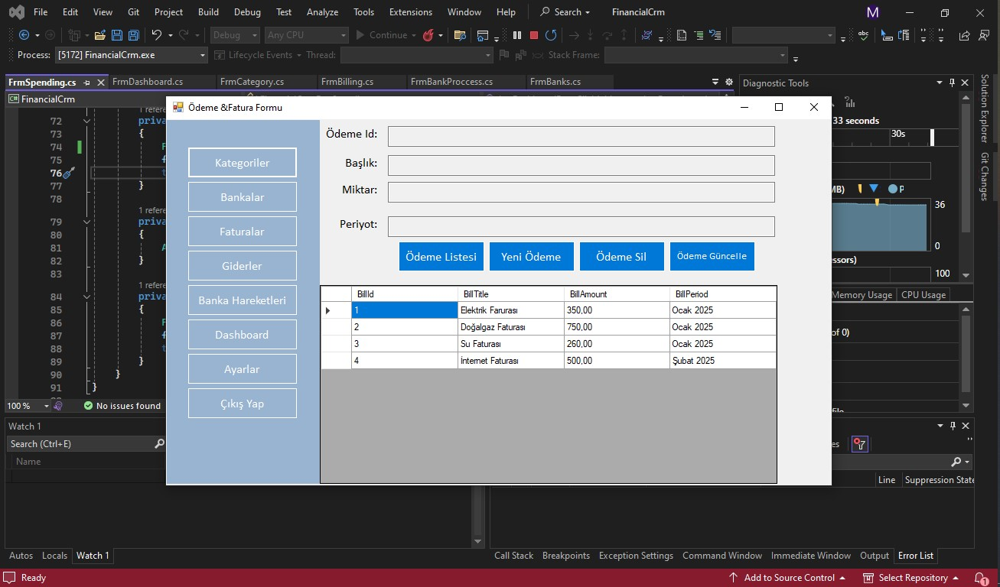



-----------FinancialCrm Uygulaması-----------

FinancialCrm, finansal işlemleri yönetmek ve takip etmek için tasarlanmış bir masaüstü uygulamasıdır. Bu uygulama, kullanıcıların banka hesaplarını, giderlerini, faturalarını ve diğer finansal işlemlerini kolayca izlemelerini sağlar. Kullanıcılar, güvenli bir şekilde giriş yaptıktan sonra, banka hesap bakiyelerini, banka işlemlerini, giderlerini ve ayarlarını yönetebilirler.

Uygulamanın Temel Özellikleri:

Kullanıcı Girişi ve Yönlendirme:
Uygulama, kullanıcı adı ve şifre ile giriş yapılmasını sağlar. Başarılı giriş sonrasında, kullanıcı ana sayfaya yönlendirilir. FrmUser formunda, kullanıcı adı ve şifre kontrol edilerek giriş yapılır.
Kullanıcı başarıyla giriş yaptıktan sonra, her sayfa, kullanıcının ID'sini alarak işlem yapabilir.

Bankalar ve Banka Bakiyeleri:
Uygulamanın bankalar modülünde, kullanıcılar farklı bankaların hesap bakiyelerini görüntüleyebilir.
Uygulama, FrmBanks formunda, Ziraat Bankası, Vakıfbank ve İş Bankası gibi bankaların bakiye bilgilerini veritabanından alır ve kullanıcıya gösterir.
Banka bakiyeleri, kullanıcıya ilgili bankaların mevcut bakiyelerini ₺ cinsinden sunar.

Banka Hareketleri:
Banka hesaplarında yapılan son işlemler, kullanıcıya FrmBanks formunda gösterilir.
Son beş banka işlemi sırasıyla, açıklama, işlem tutarı ve işlem tarihi ile birlikte listelenir.
Banka işlemleri, kullanıcıya banka hesaplarındaki en son hareketler hakkında bilgi verir.

Finansal İşlemler ve Kategoriler:
Uygulama, finansal işlemlerle ilgili yönetim modüllerine erişim sağlar. Kullanıcılar, FrmBankProccess, FrmSpending, FrmCategory, FrmBilling gibi sayfalara yönlendirilerek gelir ve gider bilgilerini yönetebilir, kategorilere ayırabilir.
Kullanıcı, yeni harcamalar (giderler) ekleyebilir ve farklı kategoriler oluşturabilir.

Ayarlar ve Kullanıcı Bilgileri:
Kullanıcılar, uygulama ayarlarına ulaşarak, şifrelerini değiştirebilir ve hesap bilgilerini güncelleyebilir.
FrmSettings formu üzerinden, kullanıcı bilgileri düzenlenebilir, şifre değiştirme işlemleri yapılabilir.

Sayfa Yönlendirmeleri:
Uygulama içerisinde her bir finansal işlem ve bilgi yönetimi için ayrı ayrı sayfalar bulunmaktadır. Kullanıcı, herhangi bir menüye tıklayarak yönlendirilir:
FrmDashboard: Kullanıcıya finansal genel bakış sayfasını sunar.
FrmBilling: Fatura bilgilerini yönetir.
FrmCategory: Kategorileri düzenler.
FrmSpending: Gider ekler.
FrmBankProccess: Banka işlemleri düzenler.
FrmSettings: Kullanıcı ayarlarını yapar.

Çıkış ve Uygulama Kapanışı:
Kullanıcı, btnExitFrm butonuyla uygulamadan çıkış yapabilir.

Teknolojik Altyapı:
Veritabanı: FinancialCrmDbEntities veri modeli üzerinden, kullanıcılar, bankalar, işlemler, giderler ve ayarlar gibi finansal veriler işlenir ve kaydedilir.
UI Framework: Uygulama, Windows Forms kullanılarak geliştirildi. Kullanıcı arayüzü, form tabanlı etkileşimler ile zenginleştirildi.
Veri Akışı ve İletişim: Kullanıcılar farklı modüller arasında geçiş yapabilir, banka hesap bakiyeleri ve işlemler gibi veriler dinamik olarak veritabanından alınır.
Mesajlaşma ve Bilgilendirme: Kullanıcı etkileşimli mesaj kutuları ile bilgilendirilir, hata durumunda gerekli uyarılar yapılır.
